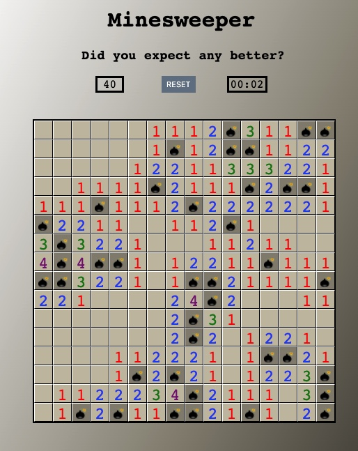
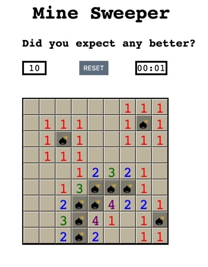
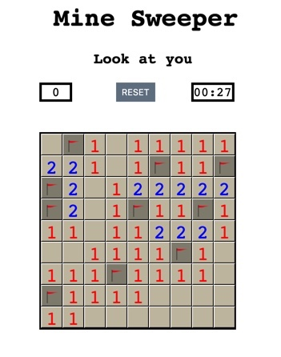

# Minesweeper Game

The objective of the game is to find all of the mines 
hidden on the board. This is accomplished using the numbers
in the spaces around each mine, which describes how many mines
are in the surrounding spaces. There are three dificulties;
easy, medium, and hard. Growing up, minesweeper was one of the
only games I had to play and it has always stuck with me as one of my favorites. 

## Screenshot

## Technologies Used

* HTML
* JavaScript
* CSS
* jQuery

## Getting Started

To try out Minesweeper, click [here](https://jfernnn.github.io/Minesweeper-P1/)

## Next Steps

1. Add a third difficulty that is a rectangle

## Icebox
## Future Improvements