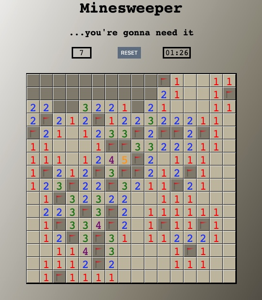
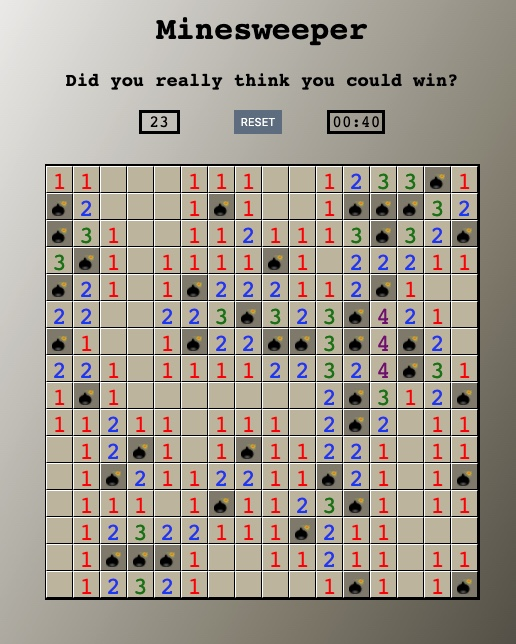
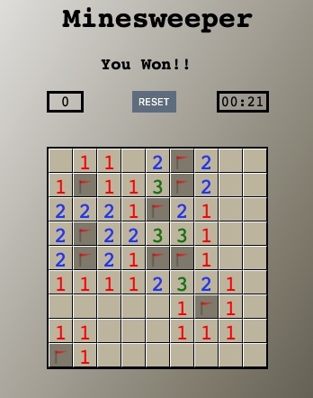

# Minesweeper Game
The classic game of finding all mines on the board. Growing up, minesweeper was one of the only games I had to play and it has always stuck with me as one of my favorites. 

## Getting Started
The objective of the game is to find all of the mines 
hidden on the board. This is accomplished using the numbers
in the spaces around each mine, which describes how many mines
are in the surrounding spaces. There are two dificulties,
easy and hard. To start the game, choose a difficulty and click on an empty square on the board. Right click on a square to mark it as a mine. To try out Minesweeper, click [here](https://jfernnn.github.io/Minesweeper-P1/).

## Screenshots

### Startup

### Easy Board

### Hard Board

### In game play

### Losing screen

### Winning screen

## Technologies Used

* HTML
* JavaScript
* CSS
* jQuery

## Next Steps

1. Add a third difficulty that is a rectangle
