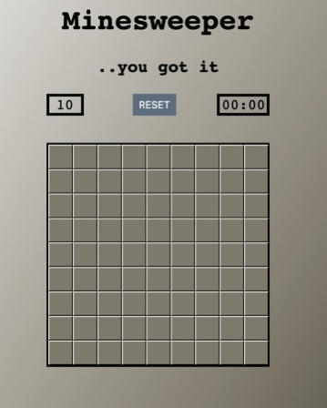
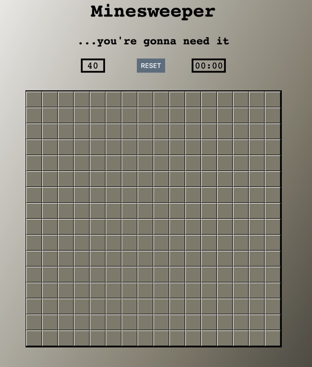

# Minesweeper Game
The classic game of finding all mines all the board. Growing up, minesweeper was one of the only games I had to play and it has always stuck with me as one of my favorites. 

## Getting Started
The objective of the game is to find all of the mines 
hidden on the board. This is accomplished using the numbers
in the spaces around each mine, which describes how many mines
are in the surrounding spaces. There are two dificulties,
easy and hard.

## Screenshots

### Startup

### In game play

### Losing screen

### Winning screen

## Technologies Used

* HTML
* JavaScript
* CSS
* jQuery

## Getting Started

To try out Minesweeper, click [here](https://jfernnn.github.io/Minesweeper-P1/)

## Next Steps

1. Add a third difficulty that is a rectangle
